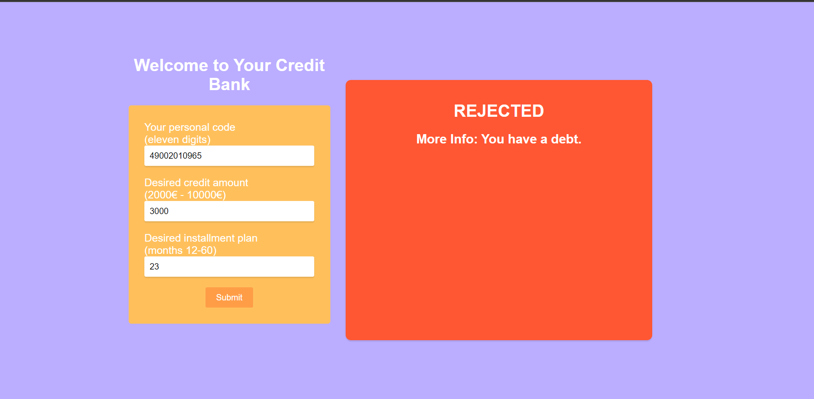
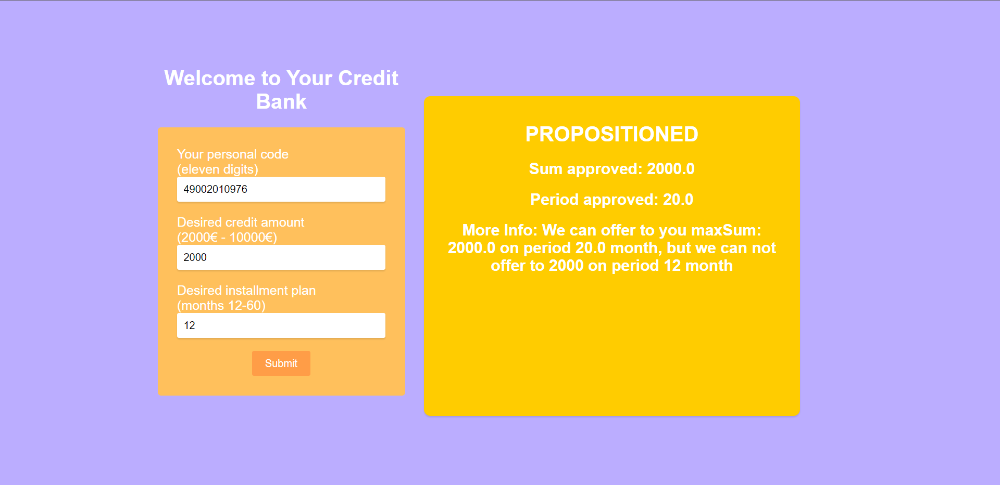
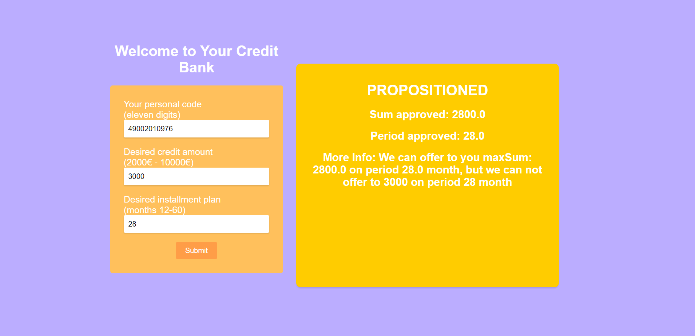
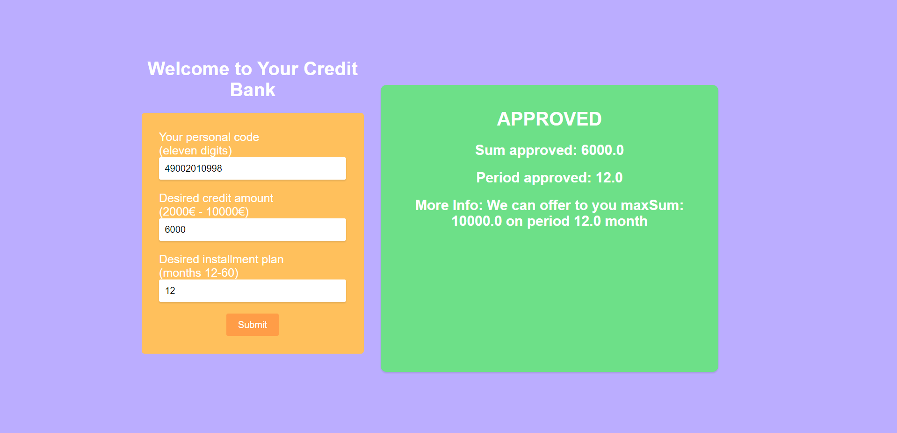
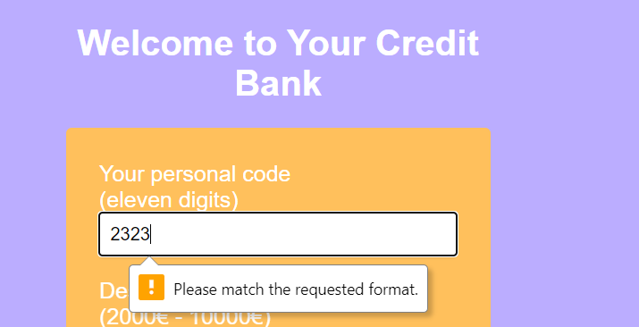
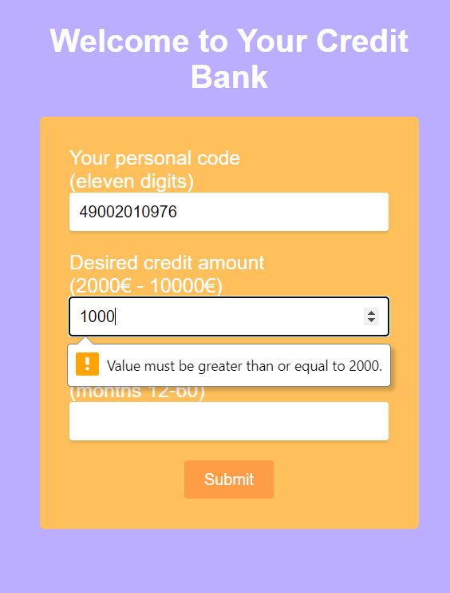
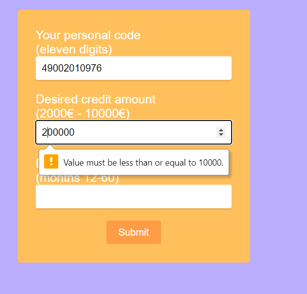
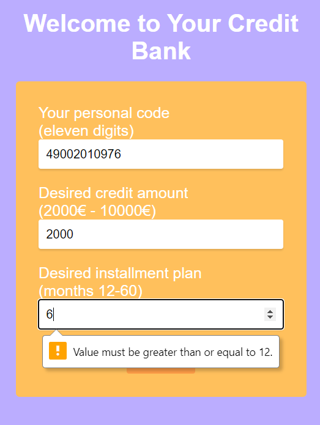
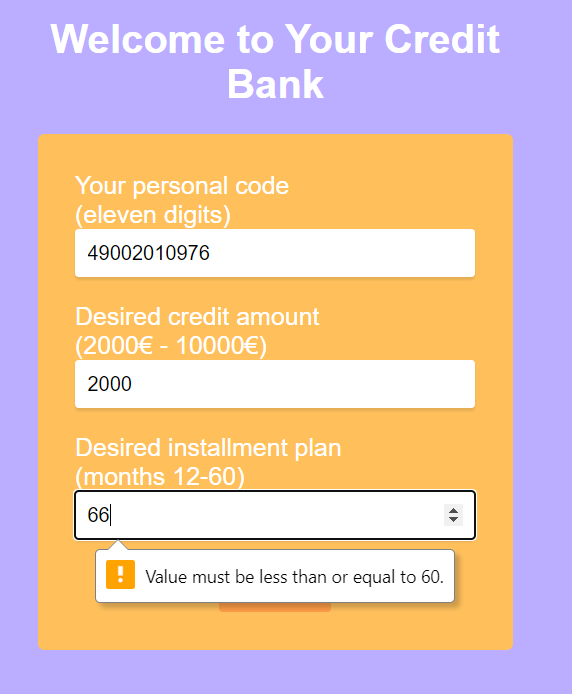
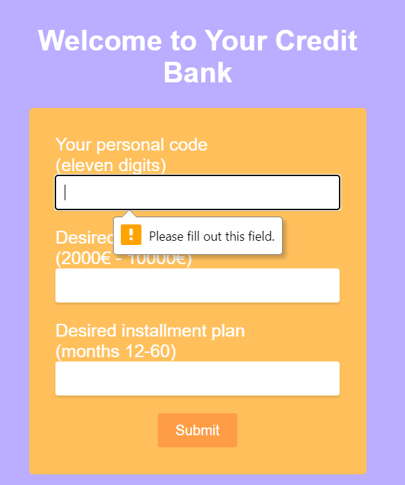

# inbank_frontend
## project technology:
 
 - @vue/cli 5.0.8

## Project setup
```
npm install
```

### Compiles and hot-reloads for development
```
npm run serve
```

### Compiles and minifies for production
```
npm run build
```

### Lints and fixes files
```
npm run lint
```

## Personal experience

 - Because previously I have never worked with the front end, and if I did, then at most I was setting up requests and responses, so this part for me was much more difficult than the back end and it took more time. But thanks to various templates from the Internet I was satisfied with the result.

## Results

### 49002010965 - debt




### 49002010976 - 2000 - 12 - offer another mouth amount




### 49002010976 - 3000 - 28 - offer another sum amount




### 49002010998 - 6000 - 12 - accept offer additional another max sum



### Limitations

\
\
\
\
\
\